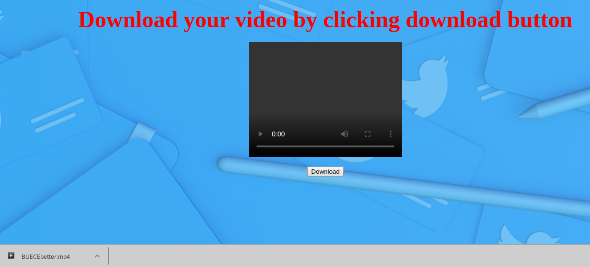

# Goal    
Make your HW4 "Convert Tweet contents to a video" a REST service running on AWS      

## Live Demo   
You can view my basic UI [here](https://zhou-1.github.io/twitter-summarizer-rest-service-zhou-1/)      

## Details   
Step 1: Use Flask as your WEB service platform     
Reference 1:  https://palletsprojects.com/p/flask/ (Github:  https://github.com/pallets/flask )   
Reference 2:  Flask-RESTFUL  (Github:  https://github.com/flask-restful/flask-restful )     
Use Python and Flask to achieve the RESTful services.    

Step 2:  Integrate your module to become a RESTFUL system   
Deploy your system to free AWS services:  https://aws.amazon.com/free/?all-free-tier.sort-by=item.additionalFields.SortRank&all-free-tier.sort-order=asc    
Develop simple WEB applications to test your system.      

## Caution  
Document your REST APIs on your Github    
Keep your server off until we request it for grading.  We dont want you to waste money.     

# Set up    
## Flask    
Command for downloading Flask using pip     
```
pip install -U Flask
```
## Flask-RESTful     
Install Flask-RESTful with pip    
```
pip install flask-restful
```

### Examples    
#### Flask &Flask-RESTful     
Examples can be [viewed here](https://github.com/BUEC500C1/twitter-summarizer-rest-service-zhou-1/tree/master/FlaskProj)    

## This project   
clone this repo     
```
git clone https://github.com/BUEC500C1/twitter-summarizer-rest-service-zhou-1.git
```

Install all requirements for this program   
```
pip3 install -r requirements.txt
```

<b> Important! </b> Please go to keys file, to add in your own Tweepy API keys in below format:
```
[auth]
consumer_key = ****
consumer_secret = ****
access_token = ****
access_secret = ****
```

### Run this program    
On your shell/terminal, run this program by typing below command:   
```
python flaskWeb.py
```
Then you can go to link: http://127.0.0.1:5000/ to see the main page.    
The index page will be looked like below:    
     

Once you type in the Twitter ID you would like to search for, click the submit button; the program will take you to download page directly. Download page looks like below:
     

# Deployment to AWS    
My program is running on an AWS EC2 instance inside of a docker container.   

## Tutorials 
[Connecting to Your Linux Instance Using SSH](https://docs.aws.amazon.com/AWSEC2/latest/UserGuide/AccessingInstancesLinux.html)       
[How To Launch Amazon EC2 Instance With Ubuntu](https://geraldalinio.com/aws/ec2/how-to-launch-amazon-ec2-instance-with-ubuntu-18-04/)  

## Steps   
First, create an Amazon EC2 instance with Ubuntu.   
Second, Connect the Linux Instance Using SSH.    
One way to transfer files between your local computer and a Linux instance is to use the secure copy protocol (SCP).    
Now, the program is running on AWS. When I use it, everyone can see it through:   


### use SCP to transfer a file    
use the following command to copy the file to the ec2-user home directory.    
```
scp -i /path/my-key-pair.pem /path/SampleFile.txt ec2-user@ec2-198-51-100-1.compute-1.amazonaws.com:~ 
(here, ec2-user is ubuntu)   
```

### Run AWS and App    
Connect to Your Linux Instance using an SSH Client:   
```
ssh -i /path/my-key-pair.pem ec2-user@ec2-198-51-100-1.compute-1.amazonaws.com   
```
Then run the program:   
```
sudo python3 flaskWeb.py
```

You can go to the webpage to see below interfaces:   


